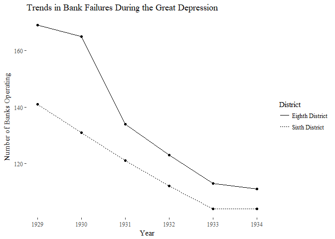

homework5
================
Mason Turpin
September 28, 2018

``` r
year <- c(1929, 1930, 1931, 1932, 1933, 1934, 1929, 1930, 1931, 1932, 1933, 1934)
banks <- c(169, 165, 134, 123, 113, 111, 141, 131, 121, 112, 104, 104)
banksap <- c(169, 165, 132, 123, 113, 111, 141, 135, 121, 112, 104, 104)
treat <- c(0, 0, 0, 0, 0, 0, 1, 1, 1, 1, 1, 1)
post <- c(0, 0, 1, 1, 1, 1, 0, 0, 1, 1, 1, 1)
district <- c("Eighth District", "Eighth District", "Eighth District", "Eighth District", "Eighth District", "Eighth District",
              "Sixth District", "Sixth District", "Sixth District", "Sixth District", "Sixth District", "Sixth District")
data.mason <- data.frame(year, banks, treat, post, district, stringsAsFactors = TRUE)
library(ggplot2)
library(ggthemes)
#estimating equation 5.3
#using my data
equation.mason <- lm(banks ~ treat + post + treat*post, data.mason)
summary(equation.mason)
```

    ## 
    ## Call:
    ## lm(formula = banks ~ treat + post + treat * post, data = data.mason)
    ## 
    ## Residuals:
    ##    Min     1Q Median     3Q    Max 
    ## -9.250 -6.250 -0.125  3.312 13.750 
    ## 
    ## Coefficients:
    ##             Estimate Std. Error t value Pr(>|t|)    
    ## (Intercept)  167.000      6.070  27.513 3.28e-09 ***
    ## treat        -31.000      8.584  -3.611 0.006869 ** 
    ## post         -46.750      7.434  -6.289 0.000236 ***
    ## treat:post    21.000     10.513   1.997 0.080834 .  
    ## ---
    ## Signif. codes:  0 '***' 0.001 '**' 0.01 '*' 0.05 '.' 0.1 ' ' 1
    ## 
    ## Residual standard error: 8.584 on 8 degrees of freedom
    ## Multiple R-squared:  0.8878, Adjusted R-squared:  0.8457 
    ## F-statistic:  21.1 on 3 and 8 DF,  p-value: 0.0003719

``` r
#using data closer to ap
data.ap <- data.frame(year, banksap, treat, post)
equation.ap <- lm(banksap ~ treat + post + treat*post, data.ap)
summary(equation.ap)
```

    ## 
    ## Call:
    ## lm(formula = banksap ~ treat + post + treat * post, data = data.ap)
    ## 
    ## Residuals:
    ##    Min     1Q Median     3Q    Max 
    ## -8.750 -6.250 -0.125  3.062 12.250 
    ## 
    ## Coefficients:
    ##             Estimate Std. Error t value Pr(>|t|)    
    ## (Intercept)  167.000      5.621  29.711 1.79e-09 ***
    ## treat        -29.000      7.949  -3.648 0.006511 ** 
    ## post         -47.250      6.884  -6.864 0.000129 ***
    ## treat:post    19.500      9.736   2.003 0.080147 .  
    ## ---
    ## Signif. codes:  0 '***' 0.001 '**' 0.01 '*' 0.05 '.' 0.1 ' ' 1
    ## 
    ## Residual standard error: 7.949 on 8 degrees of freedom
    ## Multiple R-squared:  0.9042, Adjusted R-squared:  0.8683 
    ## F-statistic: 25.17 on 3 and 8 DF,  p-value: 0.0001991

``` r
#making a regression table

ggplot(data.mason, aes(x = year, y = banks, linetype = district)) + 
  geom_point(stat = "identity") +
  geom_line() +
  labs(x="Year", y="Number of Banks Operating", title = "Trends in Bank Failures During the Great Depression") +
  scale_linetype_discrete(name="District") +
  theme_tufte()
```


