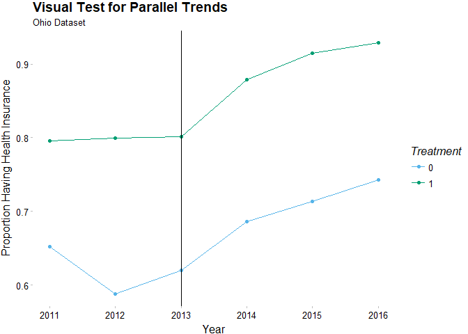

ECO361\_homework6
================
Mason Turpin
September 28, 2018

``` r
library(foreign)
data_oh <- read.dta("data/DID_OH_ver12.dta")
data_mi <- read.dta("data/DID_MI_ver12.dta")

#first models
model_oh_cost_lm <- lm(medcost ~ treat + post + treat_post, data_oh)
summary(model_oh_cost_lm)
```

    ## 
    ## Call:
    ## lm(formula = medcost ~ treat + post + treat_post, data = data_oh)
    ## 
    ## Residuals:
    ##     Min      1Q  Median      3Q     Max 
    ## -0.3156 -0.2707 -0.2320 -0.1618  0.8382 
    ## 
    ## Coefficients:
    ##              Estimate Std. Error t value Pr(>|t|)    
    ## (Intercept)  0.315620   0.004302  73.369  < 2e-16 ***
    ## treat       -0.083607   0.006135 -13.627  < 2e-16 ***
    ## post        -0.044973   0.006013  -7.480  7.6e-14 ***
    ## treat_post  -0.025208   0.008741  -2.884  0.00393 ** 
    ## ---
    ## Signif. codes:  0 '***' 0.001 '**' 0.01 '*' 0.05 '.' 0.1 ' ' 1
    ## 
    ## Residual standard error: 0.4284 on 38592 degrees of freedom
    ## Multiple R-squared:  0.01634,    Adjusted R-squared:  0.01626 
    ## F-statistic: 213.7 on 3 and 38592 DF,  p-value: < 2.2e-16

``` r
model_oh_plan_lm <- lm(hlthpln1 ~ treat + post + treat_post, data_oh)
summary(model_oh_plan_lm)
```

    ## 
    ## Call:
    ## lm(formula = hlthpln1 ~ treat + post + treat_post, data = data_oh)
    ## 
    ## Residuals:
    ##      Min       1Q   Median       3Q      Max 
    ## -0.90792  0.09208  0.20073  0.28901  0.37481 
    ## 
    ## Coefficients:
    ##             Estimate Std. Error t value Pr(>|t|)    
    ## (Intercept) 0.625189   0.004192 149.132  < 2e-16 ***
    ## treat       0.174081   0.005979  29.116  < 2e-16 ***
    ## post        0.085800   0.005859  14.644  < 2e-16 ***
    ## treat_post  0.022849   0.008518   2.682  0.00732 ** 
    ## ---
    ## Signif. codes:  0 '***' 0.001 '**' 0.01 '*' 0.05 '.' 0.1 ' ' 1
    ## 
    ## Residual standard error: 0.4175 on 38592 degrees of freedom
    ## Multiple R-squared:  0.05735,    Adjusted R-squared:  0.05728 
    ## F-statistic: 782.6 on 3 and 38592 DF,  p-value: < 2.2e-16

``` r
#means
treat_pre <- mean(data_oh$medcost[data_oh$treat == 1 & data_oh$post == 0])
treat_post <- mean(data_oh$medcost[data_oh$treat == 1 & data_oh$post == 1])
con_pre <- mean(data_oh$medcost[data_oh$treat == 0 & data_oh$post == 0])
con_post <- mean(data_oh$medcost[data_oh$treat == 0 & data_oh$post == 1])
(treat_post - treat_pre) - (con_post - con_pre)
```

    ## [1] -0.02520751

``` r
treat_pre <- mean(data_oh$hlthpln1[data_oh$treat == 1 & data_oh$post == 0])
treat_post <- mean(data_oh$hlthpln1[data_oh$treat == 1 & data_oh$post == 1])
con_pre <- mean(data_oh$hlthpln1[data_oh$treat == 0 & data_oh$post == 0])
con_post <- mean(data_oh$hlthpln1[data_oh$treat == 0 & data_oh$post == 1])
(treat_post - treat_pre) - (con_post - con_pre)
```

    ## [1] 0.02284864

``` r
#covariate models
model_oh_plan_cov <- lm(hlthpln1 ~ treat + post + treat_post + male + veteran3 +
                           children + married + divorced + widowed + separated + 
                           never_married + log_income +
                           edu_hs_grad + edu_college_attd + edu_college_grad, data_oh)
summary(model_oh_plan_cov)
```

    ## 
    ## Call:
    ## lm(formula = hlthpln1 ~ treat + post + treat_post + male + veteran3 + 
    ##     children + married + divorced + widowed + separated + never_married + 
    ##     log_income + edu_hs_grad + edu_college_attd + edu_college_grad, 
    ##     data = data_oh)
    ## 
    ## Residuals:
    ##      Min       1Q   Median       3Q      Max 
    ## -1.19060 -0.09925  0.13748  0.27050  1.02737 
    ## 
    ## Coefficients:
    ##                   Estimate Std. Error t value Pr(>|t|)    
    ## (Intercept)       0.237028   0.038392   6.174 6.73e-10 ***
    ## treat             0.130005   0.005757  22.580  < 2e-16 ***
    ## post              0.079480   0.005544  14.337  < 2e-16 ***
    ## treat_post        0.019387   0.008058   2.406   0.0161 *  
    ## male             -0.077876   0.004844 -16.078  < 2e-16 ***
    ## veteran3          0.120919   0.007558  15.999  < 2e-16 ***
    ## children         -0.072005   0.001970 -36.556  < 2e-16 ***
    ## married           0.131394   0.011618  11.309  < 2e-16 ***
    ## divorced          0.162712   0.011900  13.673  < 2e-16 ***
    ## widowed           0.279749   0.012038  23.238  < 2e-16 ***
    ## separated         0.099774   0.014141   7.056 1.75e-12 ***
    ## never_married     0.094313   0.011961   7.885 3.23e-15 ***
    ## log_income        0.027581   0.003892   7.086 1.40e-12 ***
    ## edu_hs_grad       0.047643   0.005470   8.710  < 2e-16 ***
    ## edu_college_attd  0.063310   0.006059  10.450  < 2e-16 ***
    ## edu_college_grad  0.077209   0.007451  10.362  < 2e-16 ***
    ## ---
    ## Signif. codes:  0 '***' 0.001 '**' 0.01 '*' 0.05 '.' 0.1 ' ' 1
    ## 
    ## Residual standard error: 0.3947 on 38580 degrees of freedom
    ## Multiple R-squared:  0.1576, Adjusted R-squared:  0.1572 
    ## F-statistic: 481.1 on 15 and 38580 DF,  p-value: < 2.2e-16

``` r
model_oh_cost_cov <- lm(medcost ~ treat + post + treat_post + male + veteran3 +
                           children + married + divorced + widowed + separated + 
                           never_married + log_income +
                           edu_hs_grad + edu_college_attd + edu_college_grad, data_oh)
summary(model_oh_cost_cov)
```

    ## 
    ## Call:
    ## lm(formula = medcost ~ treat + post + treat_post + male + veteran3 + 
    ##     children + married + divorced + widowed + separated + never_married + 
    ##     log_income + edu_hs_grad + edu_college_attd + edu_college_grad, 
    ##     data = data_oh)
    ## 
    ## Residuals:
    ##     Min      1Q  Median      3Q     Max 
    ## -0.7361 -0.2754 -0.1871  0.0302  1.0420 
    ## 
    ## Coefficients:
    ##                    Estimate Std. Error t value Pr(>|t|)    
    ## (Intercept)       0.8425428  0.0407531  20.674  < 2e-16 ***
    ## treat            -0.0549931  0.0061115  -8.998  < 2e-16 ***
    ## post             -0.0399906  0.0058846  -6.796 1.09e-11 ***
    ## treat_post       -0.0235616  0.0085538  -2.755 0.005881 ** 
    ## male             -0.0179895  0.0051415  -3.499 0.000468 ***
    ## veteran3         -0.0659640  0.0080229  -8.222  < 2e-16 ***
    ## children          0.0391409  0.0020909  18.720  < 2e-16 ***
    ## married          -0.0783071  0.0123328  -6.350 2.18e-10 ***
    ## divorced         -0.0731136  0.0126317  -5.788 7.17e-09 ***
    ## widowed          -0.1958486  0.0127788 -15.326  < 2e-16 ***
    ## separated         0.0135917  0.0150107   0.905 0.365223    
    ## never_married    -0.0925484  0.0126968  -7.289 3.18e-13 ***
    ## log_income       -0.0470450  0.0041316 -11.387  < 2e-16 ***
    ## edu_hs_grad      -0.0147683  0.0058064  -2.543 0.010980 *  
    ## edu_college_attd  0.0079766  0.0064312   1.240 0.214874    
    ## edu_college_grad  0.0006221  0.0079097   0.079 0.937311    
    ## ---
    ## Signif. codes:  0 '***' 0.001 '**' 0.01 '*' 0.05 '.' 0.1 ' ' 1
    ## 
    ## Residual standard error: 0.419 on 38580 degrees of freedom
    ## Multiple R-squared:  0.05933,    Adjusted R-squared:  0.05896 
    ## F-statistic: 162.2 on 15 and 38580 DF,  p-value: < 2.2e-16

``` r
#
#graph for coverage
#
library(ggplot2)
data_oh$hlthpln1_n <- NA
table(data_oh$year[data_oh$hlthpln1 == 1 & data_oh$treat == 1])
```

    ## 
    ## 2011 2012 2013 2014 2015 2016 
    ## 2125 2879 2661 2501 2570 2817

``` r
table(data_oh$year[data_oh$hlthpln1 == 1 & data_oh$treat == 0])
```

    ## 
    ## 2011 2012 2013 2014 2015 2016 
    ## 2751 1550 1899 2653 2673 2069

``` r
table(data_oh$year[data_oh$treat == 0])
```

    ## 
    ## 2011 2012 2013 2014 2015 2016 
    ## 4221 2635 3061 3869 3745 2787

``` r
table(data_oh$year[data_oh$treat == 1])
```

    ## 
    ## 2011 2012 2013 2014 2015 2016 
    ## 2669 3602 3319 2845 2811 3032

``` r
#treatment
data_oh$hlthpln1_n[data_oh$year == 2011 & data_oh$treat == 1] <- 2125 / 2669
data_oh$hlthpln1_n[data_oh$year == 2012 & data_oh$treat == 1] <- 2879 / 3602
data_oh$hlthpln1_n[data_oh$year == 2013 & data_oh$treat == 1] <- 2661 / 3319
data_oh$hlthpln1_n[data_oh$year == 2014 & data_oh$treat == 1] <- 2501 / 2845
data_oh$hlthpln1_n[data_oh$year == 2015 & data_oh$treat == 1] <- 2570 / 2811
data_oh$hlthpln1_n[data_oh$year == 2016 & data_oh$treat == 1] <- 2817 / 3032

#control
data_oh$hlthpln1_n[data_oh$year == 2011 & data_oh$treat == 0] <- 2751 / 4221
data_oh$hlthpln1_n[data_oh$year == 2012 & data_oh$treat == 0] <- 1550 / 2635
data_oh$hlthpln1_n[data_oh$year == 2013 & data_oh$treat == 0] <- 1899 / 3061
data_oh$hlthpln1_n[data_oh$year == 2014 & data_oh$treat == 0] <- 2653 / 3869
data_oh$hlthpln1_n[data_oh$year == 2015 & data_oh$treat == 0] <- 2673 / 3745
data_oh$hlthpln1_n[data_oh$year == 2016 & data_oh$treat == 0] <- 2069 / 2787

library(ggthemes)
library(scales)
ggplot(data_oh) + 
  geom_line(aes(x = year, y = hlthpln1_n, group = factor(treat), color = factor(treat))) +
  geom_point(aes(x = year, y = hlthpln1_n, group = factor(treat), color = factor(treat))) +
  geom_vline(xintercept = 2013) +
  labs(x = "Year", y = "Proportion Having Health Insurance", color = "Treatment", 
       title = "Visual Test for Parallel Trends", subtitle = "Ohio Dataset") +
  theme_pander() + scale_color_pander()
```



``` r
#
#graphs for cost
#
data_oh$medcost_n <- NA
table(data_oh$year[data_oh$medcost == 1 & data_oh$treat == 1])
```

    ## 
    ## 2011 2012 2013 2014 2015 2016 
    ##  580  858  787  552  425  429

``` r
table(data_oh$year[data_oh$medcost == 1 & data_oh$treat == 0])
```

    ## 
    ## 2011 2012 2013 2014 2015 2016 
    ## 1315  871  944 1081 1020  714

``` r
table(data_oh$year[data_oh$treat == 0])
```

    ## 
    ## 2011 2012 2013 2014 2015 2016 
    ## 4221 2635 3061 3869 3745 2787

``` r
table(data_oh$year[data_oh$treat == 1])
```

    ## 
    ## 2011 2012 2013 2014 2015 2016 
    ## 2669 3602 3319 2845 2811 3032

``` r
#treatment
data_oh$medcost_n[data_oh$year == 2011 & data_oh$treat == 1] <- 580 / 2669
data_oh$medcost_n[data_oh$year == 2012 & data_oh$treat == 1] <- 858 / 3602
data_oh$medcost_n[data_oh$year == 2013 & data_oh$treat == 1] <- 787 / 3319
data_oh$medcost_n[data_oh$year == 2014 & data_oh$treat == 1] <- 552 / 2845
data_oh$medcost_n[data_oh$year == 2015 & data_oh$treat == 1] <- 425 / 2811
data_oh$medcost_n[data_oh$year == 2016 & data_oh$treat == 1] <- 429 / 3032

#control
data_oh$medcost_n[data_oh$year == 2011 & data_oh$treat == 0] <- 1315 / 4221
data_oh$medcost_n[data_oh$year == 2012 & data_oh$treat == 0] <- 871 / 2635
data_oh$medcost_n[data_oh$year == 2013 & data_oh$treat == 0] <- 944 / 3061
data_oh$medcost_n[data_oh$year == 2014 & data_oh$treat == 0] <- 1081 / 3869
data_oh$medcost_n[data_oh$year == 2015 & data_oh$treat == 0] <- 1020 / 3745
data_oh$medcost_n[data_oh$year == 2016 & data_oh$treat == 0] <- 714 / 2787

ggplot(data_oh, aes(x = year, y = medcost_n, group = factor(treat), color = factor(treat))) + 
  geom_line() +
  geom_point() +
  geom_vline(xintercept = 2013) +
  labs(x = "Year", y = "Proportion Skipping Healthcare Due to Cost", color = "Treatment", 
       title = "Visual Test for Parallel Trends", subtitle = "Ohio Dataset") +
  theme_pander() + scale_color_pander()
```


