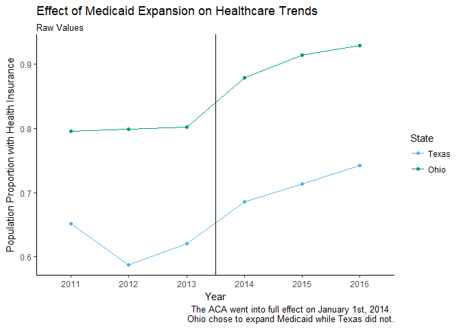
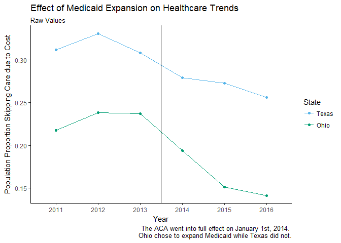
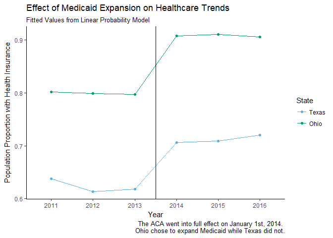
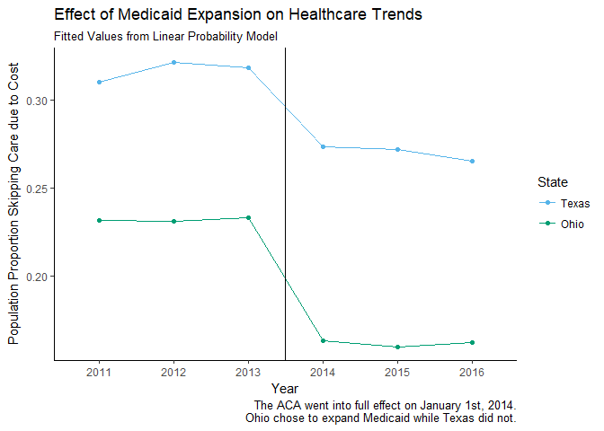
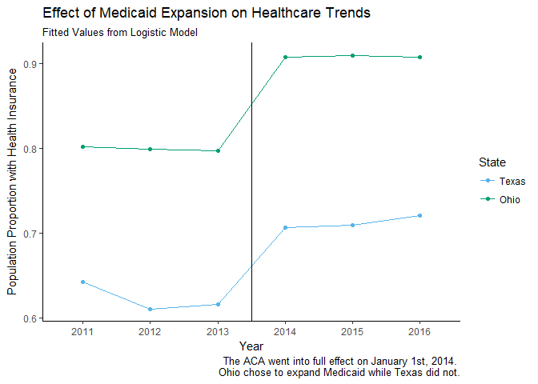
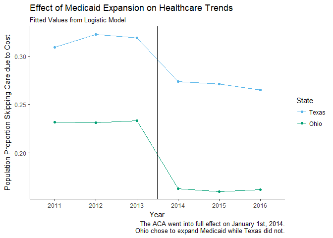

Medicaid Expansion - Differences in Differences
================
Mason Turpin
March 6, 2019

First, I read in the data. This data was given as part of an assignment in an Empirical Public Economics course taught by Dr. Sibley at UT-Austin. The assignment was to find out if there was a significant effect on individuals having insurance and individuals skipping healthcare due to cost after Medicaid was expanded in Ohio, and not expanded in Texas. Ohio was chosen since it was favorable to the parallel trends assumption essential to a DiD analysis.

``` r
library(foreign)
library(tidyverse)
```

    ## -- Attaching packages ---------------------------------------------------------------------------------- tidyverse 1.2.1 --

    ## v ggplot2 2.2.1     v purrr   0.2.5
    ## v tibble  1.4.2     v dplyr   0.7.6
    ## v tidyr   0.8.1     v stringr 1.3.1
    ## v readr   1.1.1     v forcats 0.3.0

    ## Warning: package 'dplyr' was built under R version 3.5.1

    ## -- Conflicts ------------------------------------------------------------------------------------- tidyverse_conflicts() --
    ## x dplyr::filter() masks stats::filter()
    ## x dplyr::lag()    masks stats::lag()

``` r
data_oh <- read.dta("data/DID_OH_ver12.dta")
```

Next, I consider two types of models to accomodate a Differences-in-Differences framework. The first is a linear probability model. It has the advantage of ease of interpretation, and often does well enough to make it a favorable choice. I also consider a logistic model, which will bind predictions between 1 and 0. This makes sense given our outcomes are binary variables. Our outcomes, again, are whether an individual has health insurance and whether they have skipped care due to cost. I append the fitted values for ease of plotting.

``` r
model_plan <- lm(hlthpln1 ~ treat + post + treat_post + male + veteran3 + children +
              married + divorced + widowed + separated + never_married +
              log_income + edu_hs_grad + edu_college_attd + 
              edu_college_grad, data_oh)
summary(model_plan)
```

    ## 
    ## Call:
    ## lm(formula = hlthpln1 ~ treat + post + treat_post + male + veteran3 + 
    ##     children + married + divorced + widowed + separated + never_married + 
    ##     log_income + edu_hs_grad + edu_college_attd + edu_college_grad, 
    ##     data = data_oh)
    ## 
    ## Residuals:
    ##      Min       1Q   Median       3Q      Max 
    ## -1.19060 -0.09925  0.13748  0.27050  1.02737 
    ## 
    ## Coefficients:
    ##                   Estimate Std. Error t value Pr(>|t|)    
    ## (Intercept)       0.237028   0.038392   6.174 6.73e-10 ***
    ## treat             0.130005   0.005757  22.580  < 2e-16 ***
    ## post              0.079480   0.005544  14.337  < 2e-16 ***
    ## treat_post        0.019387   0.008058   2.406   0.0161 *  
    ## male             -0.077876   0.004844 -16.078  < 2e-16 ***
    ## veteran3          0.120919   0.007558  15.999  < 2e-16 ***
    ## children         -0.072005   0.001970 -36.556  < 2e-16 ***
    ## married           0.131394   0.011618  11.309  < 2e-16 ***
    ## divorced          0.162712   0.011900  13.673  < 2e-16 ***
    ## widowed           0.279749   0.012038  23.238  < 2e-16 ***
    ## separated         0.099774   0.014141   7.056 1.75e-12 ***
    ## never_married     0.094313   0.011961   7.885 3.23e-15 ***
    ## log_income        0.027581   0.003892   7.086 1.40e-12 ***
    ## edu_hs_grad       0.047643   0.005470   8.710  < 2e-16 ***
    ## edu_college_attd  0.063310   0.006059  10.450  < 2e-16 ***
    ## edu_college_grad  0.077209   0.007451  10.362  < 2e-16 ***
    ## ---
    ## Signif. codes:  0 '***' 0.001 '**' 0.01 '*' 0.05 '.' 0.1 ' ' 1
    ## 
    ## Residual standard error: 0.3947 on 38580 degrees of freedom
    ## Multiple R-squared:  0.1576, Adjusted R-squared:  0.1572 
    ## F-statistic: 481.1 on 15 and 38580 DF,  p-value: < 2.2e-16

``` r
model_cost <- lm(medcost ~ treat + post + treat_post + male + veteran3 + children +
              married + divorced + widowed + separated + never_married +
              log_income + edu_hs_grad + edu_college_attd + 
              edu_college_grad, data_oh)
summary(model_cost)
```

    ## 
    ## Call:
    ## lm(formula = medcost ~ treat + post + treat_post + male + veteran3 + 
    ##     children + married + divorced + widowed + separated + never_married + 
    ##     log_income + edu_hs_grad + edu_college_attd + edu_college_grad, 
    ##     data = data_oh)
    ## 
    ## Residuals:
    ##     Min      1Q  Median      3Q     Max 
    ## -0.7361 -0.2754 -0.1871  0.0302  1.0420 
    ## 
    ## Coefficients:
    ##                    Estimate Std. Error t value Pr(>|t|)    
    ## (Intercept)       0.8425428  0.0407531  20.674  < 2e-16 ***
    ## treat            -0.0549931  0.0061115  -8.998  < 2e-16 ***
    ## post             -0.0399906  0.0058846  -6.796 1.09e-11 ***
    ## treat_post       -0.0235616  0.0085538  -2.755 0.005881 ** 
    ## male             -0.0179895  0.0051415  -3.499 0.000468 ***
    ## veteran3         -0.0659640  0.0080229  -8.222  < 2e-16 ***
    ## children          0.0391409  0.0020909  18.720  < 2e-16 ***
    ## married          -0.0783071  0.0123328  -6.350 2.18e-10 ***
    ## divorced         -0.0731136  0.0126317  -5.788 7.17e-09 ***
    ## widowed          -0.1958486  0.0127788 -15.326  < 2e-16 ***
    ## separated         0.0135917  0.0150107   0.905 0.365223    
    ## never_married    -0.0925484  0.0126968  -7.289 3.18e-13 ***
    ## log_income       -0.0470450  0.0041316 -11.387  < 2e-16 ***
    ## edu_hs_grad      -0.0147683  0.0058064  -2.543 0.010980 *  
    ## edu_college_attd  0.0079766  0.0064312   1.240 0.214874    
    ## edu_college_grad  0.0006221  0.0079097   0.079 0.937311    
    ## ---
    ## Signif. codes:  0 '***' 0.001 '**' 0.01 '*' 0.05 '.' 0.1 ' ' 1
    ## 
    ## Residual standard error: 0.419 on 38580 degrees of freedom
    ## Multiple R-squared:  0.05933,    Adjusted R-squared:  0.05896 
    ## F-statistic: 162.2 on 15 and 38580 DF,  p-value: < 2.2e-16

``` r
data_oh$plan_fit <- model_plan$fitted.values
data_oh$cost_fit <- model_cost$fitted.values

#logistic
logi_plan <- glm(hlthpln1 ~ treat + post + treat_post + male + veteran3 + children +
                 married + divorced + widowed + separated + never_married +
                 log_income + edu_hs_grad + edu_college_attd + 
                 edu_college_grad, data = data_oh, family = "binomial")
summary(logi_plan)
```

    ## 
    ## Call:
    ## glm(formula = hlthpln1 ~ treat + post + treat_post + male + veteran3 + 
    ##     children + married + divorced + widowed + separated + never_married + 
    ##     log_income + edu_hs_grad + edu_college_attd + edu_college_grad, 
    ##     family = "binomial", data = data_oh)
    ## 
    ## Deviance Residuals: 
    ##     Min       1Q   Median       3Q      Max  
    ## -3.0519   0.1919   0.4685   0.7614   2.3186  
    ## 
    ## Coefficients:
    ##                  Estimate Std. Error z value Pr(>|z|)    
    ## (Intercept)      -1.80555    0.23366  -7.727 1.10e-14 ***
    ## treat             0.71376    0.03542  20.153  < 2e-16 ***
    ## post              0.41186    0.03223  12.780  < 2e-16 ***
    ## treat_post        0.50826    0.05670   8.963  < 2e-16 ***
    ## male             -0.43787    0.02910 -15.047  < 2e-16 ***
    ## veteran3          0.82998    0.05578  14.879  < 2e-16 ***
    ## children         -0.34335    0.01124 -30.547  < 2e-16 ***
    ## married           0.62520    0.06444   9.702  < 2e-16 ***
    ## divorced          0.78546    0.06690  11.741  < 2e-16 ***
    ## widowed           1.96686    0.07501  26.221  < 2e-16 ***
    ## separated         0.47788    0.07856   6.083 1.18e-09 ***
    ## never_married     0.39637    0.06629   5.979 2.24e-09 ***
    ## log_income        0.17560    0.02391   7.344 2.07e-13 ***
    ## edu_hs_grad       0.26255    0.03385   7.757 8.73e-15 ***
    ## edu_college_attd  0.34542    0.03785   9.126  < 2e-16 ***
    ## edu_college_grad  0.43063    0.04721   9.122  < 2e-16 ***
    ## ---
    ## Signif. codes:  0 '***' 0.001 '**' 0.01 '*' 0.05 '.' 0.1 ' ' 1
    ## 
    ## (Dispersion parameter for binomial family taken to be 1)
    ## 
    ##     Null deviance: 42961  on 38595  degrees of freedom
    ## Residual deviance: 36425  on 38580  degrees of freedom
    ## AIC: 36457
    ## 
    ## Number of Fisher Scoring iterations: 5

``` r
logi_cost <- glm(medcost ~ treat + post + treat_post + male + veteran3 + children +
                                married + divorced + widowed + separated + never_married +
                                log_income + edu_hs_grad + edu_college_attd + 
                                edu_college_grad, data = data_oh, family = "binomial")
summary(logi_cost)
```

    ## 
    ## Call:
    ## glm(formula = medcost ~ treat + post + treat_post + male + veteran3 + 
    ##     children + married + divorced + widowed + separated + never_married + 
    ##     log_income + edu_hs_grad + edu_college_attd + edu_college_grad, 
    ##     family = "binomial", data = data_oh)
    ## 
    ## Deviance Residuals: 
    ##     Min       1Q   Median       3Q      Max  
    ## -1.6802  -0.7970  -0.6122  -0.3143   2.4870  
    ## 
    ## Coefficients:
    ##                  Estimate Std. Error z value Pr(>|z|)    
    ## (Intercept)       2.00659    0.21996   9.123  < 2e-16 ***
    ## treat            -0.28821    0.03383  -8.519  < 2e-16 ***
    ## post             -0.20190    0.03171  -6.367 1.93e-10 ***
    ## treat_post       -0.22448    0.04993  -4.496 6.92e-06 ***
    ## male             -0.09930    0.02860  -3.473 0.000516 ***
    ## veteran3         -0.46736    0.05165  -9.048  < 2e-16 ***
    ## children          0.18019    0.01067  16.883  < 2e-16 ***
    ## married          -0.35951    0.06235  -5.766 8.10e-09 ***
    ## divorced         -0.32883    0.06420  -5.122 3.02e-07 ***
    ## widowed          -1.16586    0.06824 -17.085  < 2e-16 ***
    ## separated         0.04852    0.07507   0.646 0.518086    
    ## never_married    -0.43360    0.06468  -6.703 2.04e-11 ***
    ## log_income       -0.25177    0.02248 -11.197  < 2e-16 ***
    ## edu_hs_grad      -0.08269    0.03270  -2.529 0.011453 *  
    ## edu_college_attd  0.05743    0.03579   1.605 0.108567    
    ## edu_college_grad  0.01232    0.04437   0.278 0.781241    
    ## ---
    ## Signif. codes:  0 '***' 0.001 '**' 0.01 '*' 0.05 '.' 0.1 ' ' 1
    ## 
    ## (Dispersion parameter for binomial family taken to be 1)
    ## 
    ##     Null deviance: 43247  on 38595  degrees of freedom
    ## Residual deviance: 40886  on 38580  degrees of freedom
    ## AIC: 40918
    ## 
    ## Number of Fisher Scoring iterations: 4

``` r
data_oh$logi_plan_fit <- logi_plan$fitted.values
data_oh$logi_cost_fit <- logi_cost$fitted.values
```

Last, I plot the results of our analysis. As you can see from each plot (not to mention the output above), there is a small but significant change in each outcome after the policy change.

``` r
library(ggthemes)
library(scales)
```

    ## Warning: package 'scales' was built under R version 3.5.1

    ## 
    ## Attaching package: 'scales'

    ## The following object is masked from 'package:purrr':
    ## 
    ##     discard

    ## The following object is masked from 'package:readr':
    ## 
    ##     col_factor

``` r
data_oh$treat <- factor(data_oh$treat, levels = c(0, 1), labels = c("Texas", "Ohio"))
data_oh$year <- factor(data_oh$year)

ggplot(data = data_oh %>% 
         group_by(treat, year) %>% 
         summarise(hlthpln1_prop = sum(hlthpln1)/length(hlthpln1))) +
  geom_line(aes(x = year, y = hlthpln1_prop, group = treat, color = treat)) +
  geom_point(aes(x = year, y = hlthpln1_prop, group = treat, color = treat)) +
  geom_vline(xintercept = 3.5) +
  labs(x = "Year", y = "Population Proportion with Health Insurance", color = "State", 
       title = "Effect of Medicaid Expansion on Healthcare Trends", subtitle = "Raw Values",
       caption = "The ACA went into full effect on January 1st, 2014. 
       Ohio chose to expand Medicaid while Texas did not.") +
  theme_classic() + scale_color_pander()
```



``` r
ggplot(data = data_oh %>% 
         group_by(treat, year) %>% 
         summarise(medcost_prop = sum(medcost)/length(medcost))) +
  geom_line(aes(x = year, y = medcost_prop, group = treat, color = treat)) +
  geom_point(aes(x = year, y = medcost_prop, group = treat, color = treat)) +
  geom_vline(xintercept = 3.5) +
  labs(x = "Year", y = "Population Proportion Skipping Care due to Cost", color = "State", 
       title = "Effect of Medicaid Expansion on Healthcare Trends", subtitle = "Raw Values",
       caption = "The ACA went into full effect on January 1st, 2014. 
       Ohio chose to expand Medicaid while Texas did not.") +
  theme_classic() + scale_color_pander()
```



``` r
ggplot(data = data_oh %>% 
         group_by(treat, year) %>% 
         summarise(hlthpln1_prop = sum(plan_fit)/length(plan_fit))) +
  geom_line(aes(x = year, y = hlthpln1_prop, group = treat, color = treat)) +
  geom_point(aes(x = year, y = hlthpln1_prop, group = treat, color = treat)) +
  geom_vline(xintercept = 3.5) +
  labs(x = "Year", y = "Population Proportion with Health Insurance", color = "State", 
       title = "Effect of Medicaid Expansion on Healthcare Trends", subtitle = "Fitted Values from Linear Probability Model",
       caption = "The ACA went into full effect on January 1st, 2014. 
       Ohio chose to expand Medicaid while Texas did not.") +
  theme_classic() + scale_color_pander()
```



``` r
ggplot(data = data_oh %>% 
         group_by(treat, year) %>% 
         summarise(medcost_prop = sum(cost_fit)/length(cost_fit))) +
  geom_line(aes(x = year, y = medcost_prop, group = treat, color = treat)) +
  geom_point(aes(x = year, y = medcost_prop, group = treat, color = treat)) +
  geom_vline(xintercept = 3.5) +
  labs(x = "Year", y = "Population Proportion Skipping Care due to Cost", color = "State", 
       title = "Effect of Medicaid Expansion on Healthcare Trends", subtitle = "Fitted Values from Linear Probability Model",
       caption = "The ACA went into full effect on January 1st, 2014.
       Ohio chose to expand Medicaid while Texas did not.") +
  theme_classic() + scale_color_pander()
```



``` r
ggplot(data = data_oh %>% 
         group_by(treat, year) %>% 
         summarise(hlthpln1_prop = sum(logi_plan_fit)/length(logi_plan_fit))) +
  geom_line(aes(x = year, y = hlthpln1_prop, group = treat, color = treat)) +
  geom_point(aes(x = year, y = hlthpln1_prop, group = treat, color = treat)) +
  geom_vline(xintercept = 3.5) +
  labs(x = "Year", y = "Population Proportion with Health Insurance", color = "State", 
       title = "Effect of Medicaid Expansion on Healthcare Trends", subtitle = "Fitted Values from Logistic Model",
       caption = "The ACA went into full effect on January 1st, 2014. 
       Ohio chose to expand Medicaid while Texas did not.") +
  theme_classic() + scale_color_pander()
```



``` r
ggplot(data = data_oh %>% 
         group_by(treat, year) %>% 
         summarise(medcost_prop = sum(logi_cost_fit)/length(logi_cost_fit))) +
  geom_line(aes(x = year, y = medcost_prop, group = treat, color = treat)) +
  geom_point(aes(x = year, y = medcost_prop, group = treat, color = treat)) +
  geom_vline(xintercept = 3.5) +
  labs(x = "Year", y = "Population Proportion Skipping Care due to Cost", color = "State", 
       title = "Effect of Medicaid Expansion on Healthcare Trends", subtitle = "Fitted Values from Logistic Model",
       caption = "The ACA went into full effect on January 1st, 2014.
       Ohio chose to expand Medicaid while Texas did not.") +
  theme_classic() + scale_color_pander()
```


